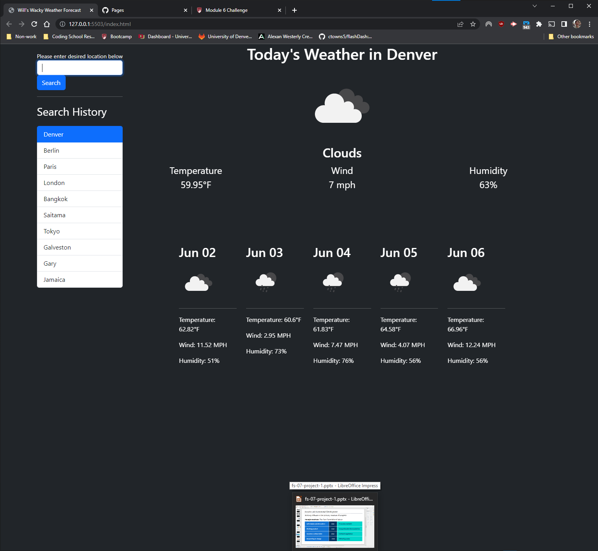

# Ol Silly Willy's Wacky Weather App

A weather dashboard that shows the weather forecast

## Link to deployed page: https://TrueWillB.github.io/ol-silly-willys-wacky-weather-app__challenge6/

## Purpose

The purpose of this site is to load weather from the openweather api and display it in an easy-to-read fashion. I did this project as part of a boot camp program learning full-stack web development. Please find screenshots at the end of the readme

## API Limitations

Although the purpose of this assignment was to pull daily forecasts from a weather API, the API that we were provided did not actually have this capability. Instead of a 5 day daily forecast, we were instead given the forecast for every 3-hour period over the next 5 days. This is a very different thing, as it is not a general forecast for a whole day, but rather a number of smaller forecasts for a given day. As such, I was forced to make a compromise, and the data is not actually what someone would be looking for coming to a site like this. I compromised and decided that the 5-day forecast would give the forecast on that day at around the same time as the query was executed. For example, if the user executes a weather search on June 1 at 6pm, the section for June 2 will show the weather that is forecast to be occurring on June 2 at 6pm. If we had access to a daily forecast, this could have been avoided, but unfortunately, that would require a paid plan to the provider of the API

## General notes

- This app has limited error catching. If the user enters a location name that is not in the API database, an error message will be displayed above the search bar
- This app does not allow for specific searching of places. If you add the city AND state, it will not function. Adding a placename simply pulls up the first entry for that place, typically the most populous city or place by that name
- The app holds up to 10 places in memory. Finding new places after that overwrites the oldest-searched place

## Screenshots

